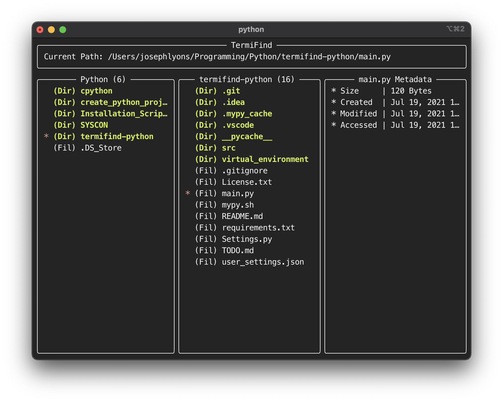

# termifind

TermiFind is TUI file finder that is heavily inspired by the MacOS Finder.



Termifind has a good amount of [settings](./settings.py) that can be overridden via a `user_setttings.json` file

Ex.

```json
{
    "LAUNCH_PATH": "/Users/josephlyons/Programming/Python/termifind-python/main.py",
    "IS_IN_FOCUS_MODE": false
}
```

**Note**: Termifind currently does not react to input.  I will be working on this aspect in the near future.
